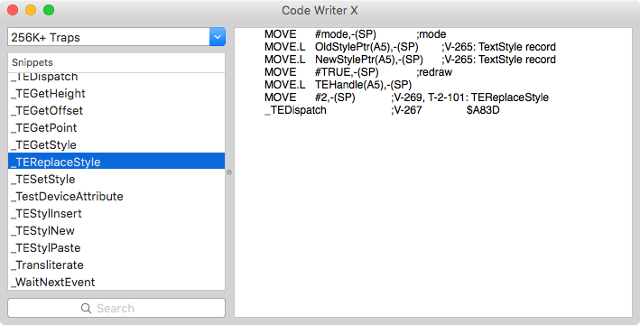

Code Writer X
=============

A tool to view Cliff Harris' CodeWriter documents under OS X.

This short program includes code (i) to parse the resource forks used under older version of the Mac OS (via the entirely up-to-date com.apple.ResourceFork extended attribute); and (ii) hence to parse and display those files created by Cliff Harris for his CodeWriter System.

The original PowerPC/68000 Classic OS document reader and Cliff's documents are available at http://home.earthlink.net/~cliff_harris/freeware/CodeWriter/index.html and are distributed as freeware. This repository includes an OS X-based reader and all available document sets.

There's no website for this project; see the Github ‘Releases’ tab to obtain builds.