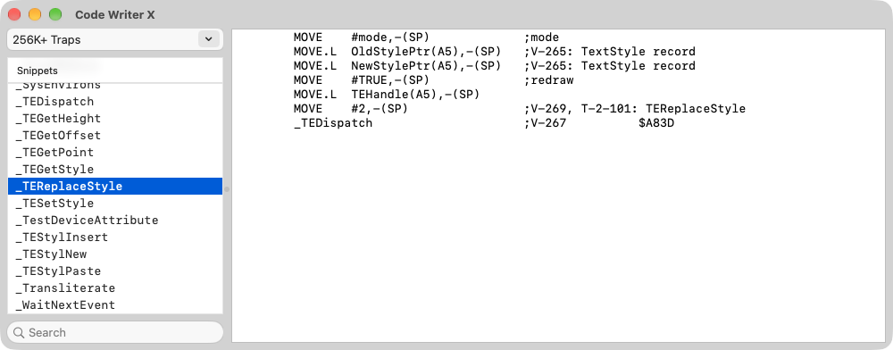

Code Writer X
=============

A tool to view Cliff Harris' CodeWriter documents on modern Macs.

This short program includes code (i) to parse the resource forks used under older version of the Mac OS (via the entirely up-to-date com.apple.ResourceFork extended attribute); and (ii) hence to parse and display those files created by Cliff Harris for his CodeWriter System.

The original PowerPC/68000 Classic OS document reader and Cliff's documents were previously available at http://home.earthlink.net/~cliff_harris/freeware/CodeWriter/index.html and were distributed as freeware. This repository includes a modern reader and a capture of all available document sets.

There's no website for this project; see the Github ‘Releases’ tab to obtain builds.
